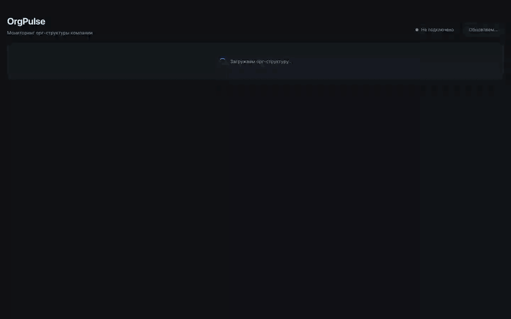

# OrgPulse



Дашборд орг-структуры: интерактивное дерево, аналитическая таблица с агрегатами,
live-обновления по WebSocket и поиск на естественном языке.

React 19 · Vite · TypeScript · React Query · styled-components · Zod · Koa · Docker

## Запуск

```bash
OPENAI_API_KEY=sk-... docker compose up
```

http://localhost:8080 — nginx отдаёт статику с gzip и проксирует `/api` вместе с WebSocket.

Без ключа — просто `docker compose up`: приложение работает полностью, поиск разбирает
запросы локальным парсером.

## Документация

| Файл | О чём |
|---|---|
| [docs/architecture.md](docs/architecture.md) | Слои, поток данных от API до UI, структура репозитория, команды |
| [docs/data-model.md](docs/data-model.md) | Дерево, алгоритм агрегации, контракт WebSocket-патча |
| [docs/api.md](docs/api.md) | Эндпоинты, конверт ошибок, переменные окружения |
| [docs/features.md](docs/features.md) | Таблица, live-обновления, AI-поиск |
| [docs/adr/](docs/adr) | Решения: контракт, валидация, агрегаты, транспорт, деградация поиска |

## AI в разработке

Проект написан в паре с Claude Code. Генерировалось всё: пакет контракта, сервер
с WebSocket-рассылкой, клиент на FSD, агрегация с инкрементальным патчем, Docker с nginx,
AI-поиск, документация. Конвенции задавались заранее, результат принимался только после
`type-check`, `lint`, тестов, сборки и прогона по API.

Бонусом демо скринкас полностью записан агентом используя дополнительные MCP и скилы

**Что генерация сделала неправильно:**

- `setState` внутри `useEffect` в двух местах — поймал eslint, переписано на
  `useSyncExternalStore` и на обработчик события
- предлог «с» утекал в текстовый фильтр, и «команды с эффективностью выше 80» не находили ничего
- промпт с распределением сломал точные запросы: «ниже 60» превращалось в p25
- модель выдумывала уровни: «ядро» → дивизион, выдача обнулялась
- предупреждение «запрос непонятен» показывалось поверх рабочей выдачи
- `.dockerignore` не исключал `.env` — секрет попадал в build-контекст
- `environment` в compose затирал ключ из `env_file` пустым значением

Проверочный скрипт тоже содержал ошибку: считал не по той ветке и давал зелёный свет
на сломанном поведении. Ошибаться может не только код, но и проверка.

Там, где промпт ненадёжен, поверх него стоят детерминированные страховки — нормализация
фильтра, гейт предупреждения по количеству результатов, отсечение коротких запросов от модели.

**Что правилось руками (Написано без ИИ):**

- Минорные баги после тестов
- env, порты, пару раз ловил голюцинации и отходил от архитектуры и патернов на фронте
- Также неучтенные продуктовые требования вроде лимитов для ИИ поиска и предупреждений с невалидными входными проектами придумал сам, чтобы бло больше похоже на продакшен реди фичу

## Этапы

- [x] **01 FOUNDATION** — проект, API, дерево
- [x] **02 CORE** — аналитическая таблица
- [x] **03 POLISH** — live-обновления и UX
- [x] **04 BONUS** — Docker/Nginx + AI-поиск
